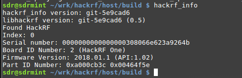

Hack RF one
============

Clone and build HackHF Repo:
----------------------------

.. code:: bash

   git clone https://github.com/mossmann/hackrf.git
   cd hackrf/host
   mkdir build && cd build && cmake .. && make
   sudo make install && sudo ldconfig

For details see `https://github.com/mossmann/hackrf <https://github.com/mossmann/hackrf>`__

Run
---

Connect the HackRF (Virtualbox Menu Devices->USB->GreatScot….) and test with: ``hackrf_info``

Check if the device is responding:

