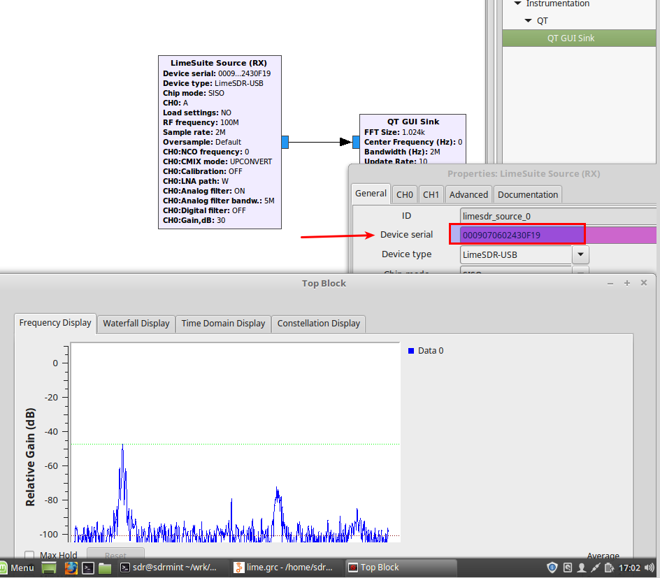
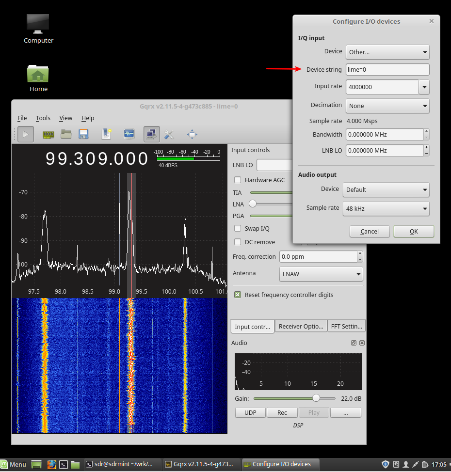

For LimeSDR owners
==================

This is not in the provided VM image - so install on your own!

Clone and install
-----------------

In the terminal type:

.. code:: bash

   pybombs install gr-limesdr
   cd ~/wrk/grc_wrk/default/src/limesuite/udev-rules
   sudo chmod +x install.sh
   sudo ./install.sh

Run
----

Connect your Lime and route it to the VM “Devices->USB etc etc.”

You can now use ``LimeUtil --find``, remember to to a ``LimeUtil --update``

.. figure:: ./img/media/image11.png
   :alt: 

You can now use the GR-Lime source and sink blocks in GNU Radio
companion:

To use the Lime in GQRX use the Device “**Other**” with Device String “**lime=0**”

