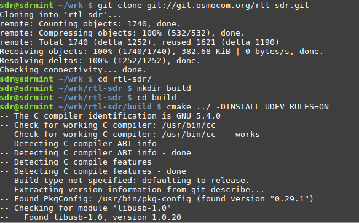
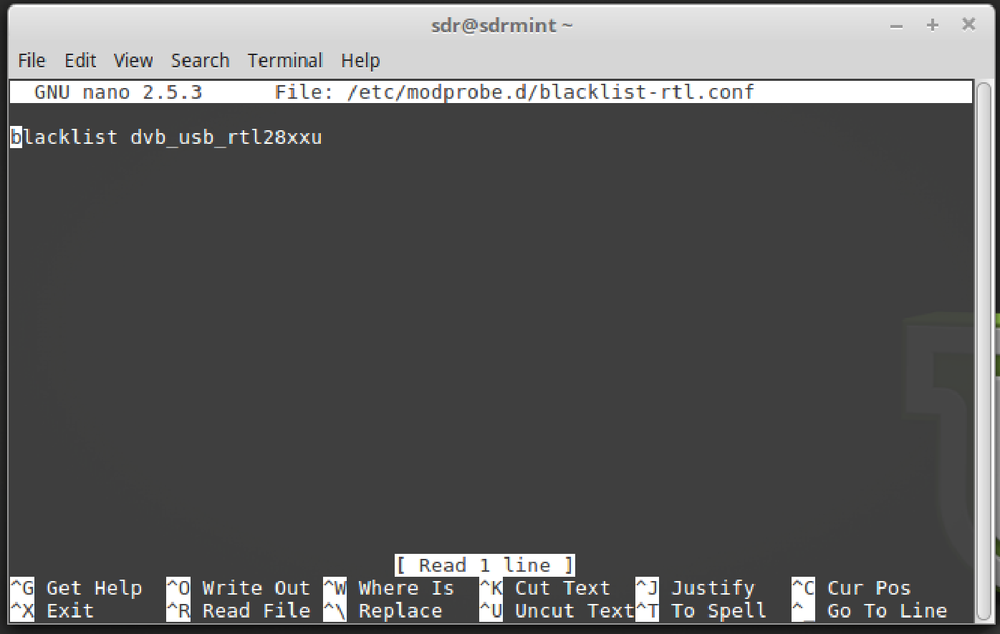
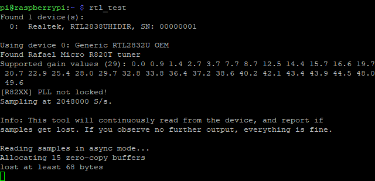
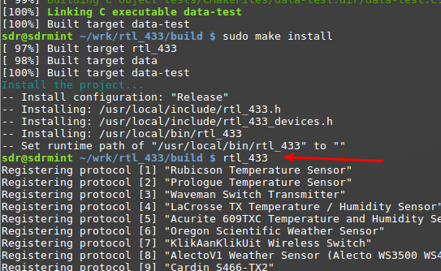

Native rtl_sdr Setup
=====================

Clone and build
---------------

In your “wrk” Directory clone and build rtl_sdr

.. code:: bash

    cd ~/wrk
    git clone git://git.osmocom.org/rtl-sdr.git
    cd rtl-sdr/
    mkdir build
    cd build
    cmake ../ -DINSTALL_UDEV_RULES=ON
    make
    sudo make install
    sudo ldconfig
    sudo cp ../rtl-sdr.rules /etc/udev/rules.d/

Create further udev Blacklist file:

``sudo nano /etc/modprobe.d/blacklist-rtl.conf``

Append: ``blacklist dvb_usb_rtl28xxu`` to the file

To exit nano and save changes press ``CTRL-X``, then type ``y``, then
enter to save and exit.

``sudo udevadm control --reload-rules && udevadm trigger``

Reboot the VM / Restart PC

Connect to your RTL Stick (**Virtual Box Menu Devices->USB-> Realtec RTL** ) The name may depend on the manufacturer of your Stick

Open a terminal and enter

Run
----

``rtl_test``

check the output if it finds the stick:

press **ctrl+c** to cancel rtl_test.

For details see
`https://osmocom.org/projects/rtl-sdr/wiki<https://osmocom.org/projects/rtl-sdr/wiki>`__

RTL_433 tool setup
-------------------

in your “wrk” Directory clone and build rtl_433:

.. code:: bash

    cd ~/wrk
    git clone https://github.com/merbanan/rtl_433.git
    cd rtl_433/ && mkdir build && cd build && cmake ../ && make
    sudo make install

Start rtl_433 (RTL-SDR)

``rtl_433``

Even if you do not own your own temperature sensor you’ll get a good amount of measurements from your urban or non urban area.

.. figure:: ./img/media/image44.png
   :alt: 

More on
`https://github.com/merbanan/rtl_433<https://github.com/merbanan/rtl_433>`__

Special hint for all MQTT fanboys:

(mosquitto_pub can be installed by:
``sudo apt install -y mosquitto-clients`` )

``rtl_433 -F json -U | mosquitto_pub -t home/rtl_433 -l``

If mosquitto runs on another server append:

``-p port -u username, -P password -t topic -R 433MHz device number``

.. code:: bash

    rtl_433 -F json -U -R 32 | mosquitto_pub -h 192.168.x.xxx -p 1883 -u admin -P admin -t home/rtl_433 -l

Will pipe the output to network as JSON formatted MQTT messages.