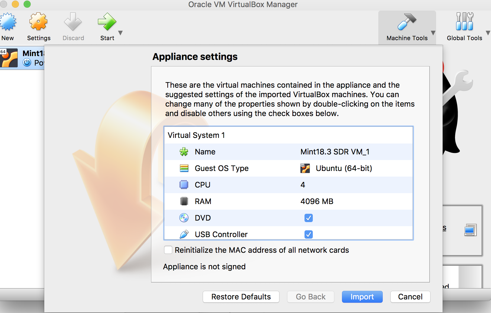
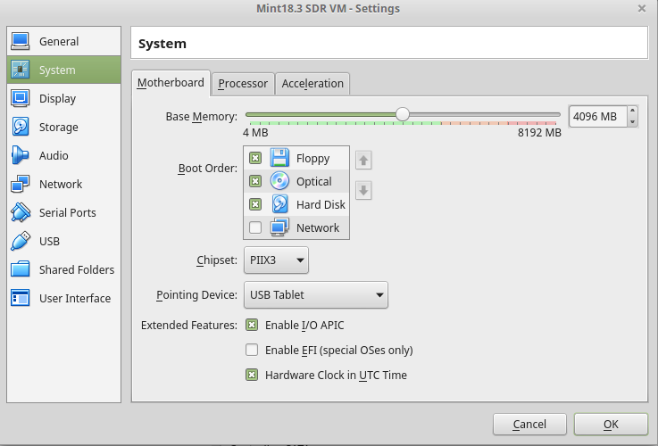
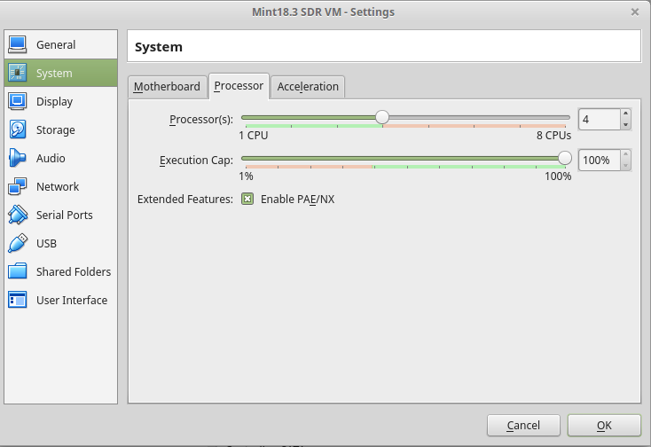
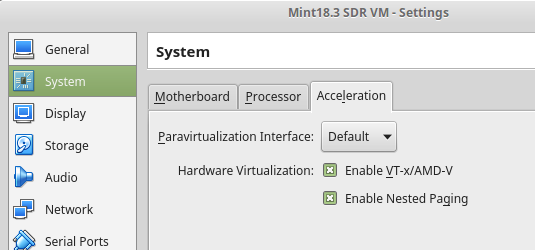
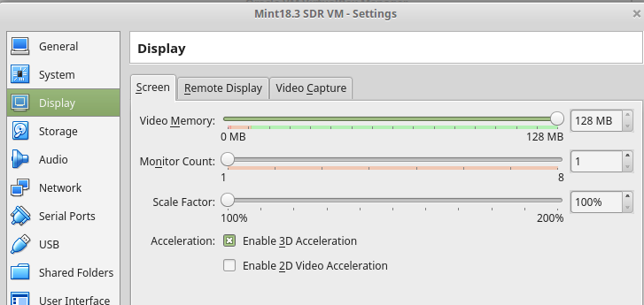
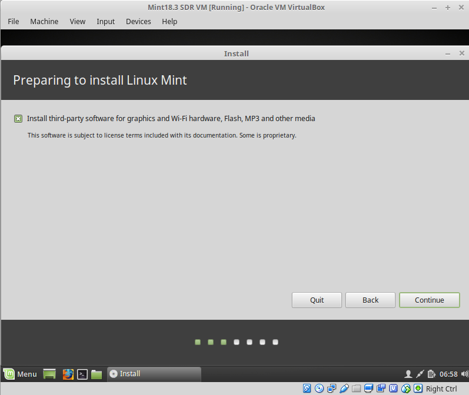
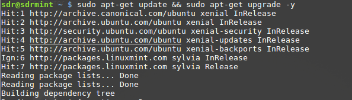
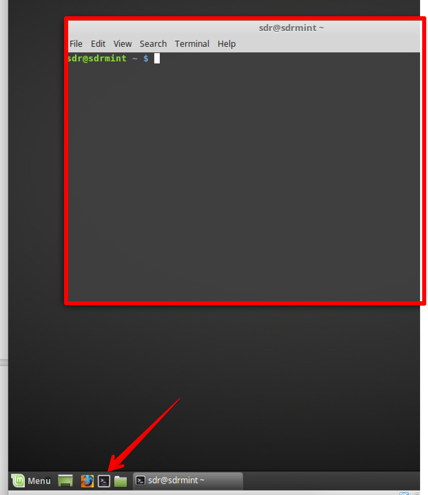

Setup VM
=========

Way A - Use my demo VM
-----------------------

I’ve uploaded my result from this tutorial to Google Drive `https://drive.google.com/open?id=1Spth19iKjler56iSXPmO325akPrYKGfa <https://drive.google.com/open?id=1Spth19iKjler56iSXPmO325akPrYKGfa>`__

You can simply import it with Virtualbox 5. it is not perfect - see it as a way to save some time.
**Anyway, I’d recommend to go Way B) below to get some hands on with Linux.**

All SDR related stuff is in ``~/wrk``
User / password in this sample VM is: ``sdr``

Import to Virtualbox
--------------------

First download and install Virtualbox and from `https://www.virtualbox.org/wiki/Downloads<https://www.virtualbox.org/wiki/Downloads>`__

**Important: Also install Oracle VM VirtualBox Extension Pack, since we want to use USB devices from within the guest machine**

This works on Windows, Linux and OS X

Double click the downloaded ova file and follow the wizard:

Way B) Setup your own VM ← “Choose this way :-)”
-------------------------------------------------

If you want to use a VM with virtualbox start here, otherwise, skip to
step “**Native Linux Setup Option**”

Create a new VM in Virtualbox and tweak some settings:

.. figure:: ./img/media/image56.png
   :alt:

Select Type “Linux” with Version “Ubuntu (64-bit)” If 64-bit is not in the list: Enable virtualization options in your system BIOS: `https://www.howtogeek.com/213795/how-to-enable-intel-vt-x-in-your-computers-bios-or-uefi-firmware/<https://www.howtogeek.com/213795/how-to-enable-intel-vt-x-in-your-computers-bios-or-uefi-firmware/>`__

Create a virtual hard drive. around 50GB should be a good choice.

Adjust the memory to max within the green range of the slider:

Adjust the number of virtual processors to max within the green range of
the slider and be sure to enable PAE/NX.

Be sure to enable VT-x/AMD-V Hardware virtualization!

Start the VM and provide the Linux Mint 64 Bit ISO, when asked. The ISO image is available from `https://www.linuxmint.com/edition.php?id=246 <https://www.linuxmint.com/edition.php?id=246>`__ In this document user and password are set to ‘sdr’. I’ve selected the option to install 3rd party applications during the setup.

Guest Additions
---------------

Complete the setup and after reboot install “Guest Additions”:

In VB Machine Window:

Menu **“Devices”->”Insert Guest Additions CD Image”** and follow the instructions.

Open a Terminal window to add your user to the group vboxsf and dialout

To open terminal you can use the small icon in the quick launch bar:

|image0| |image1|

.. code:: bash

   sudo usermod -a -G vboxsf sdr
   sudo usermod -a -G dialout sdr

Then do a system update:

``sudo apt-get update && sudo apt-get upgrade -y``

**Reboot the VM!**

Way C) Native Linux Setup option
--------------------------------

All following steps are valid for a native Linux Setup! Finding a good
Linux compatible hardware can be hard…. An unsorted, random list of
directions:

-  `https://www.tuxedocomputers.com/ <https://www.tuxedocomputers.com/>`
-  `https://www.techradar.com/news/best-linux-laptops-of-2018 <https://www.techradar.com/news/best-linux-laptops-of-2018>`__
-  `https://www.slant.co/topics/1184/~laptops-for-linux <https://www.slant.co/topics/1184/~laptops-for-linux>`__
-  `https://hblok.net/blog/posts/2017/03/21/linux-compatible-notebooks-and-laptops/ <https://hblok.net/blog/posts/2017/03/21/linux-compatible-notebooks-and-laptops/>`__

From my experience most important is to have working graphics, touchpad and sound. Personally I swear on not to bleeding edge Lenovo aka. “IBM” or Dell hardware… this is not the topic of this tutorial, but keep in mind to focus on hardware specs to be well supported by Linux when looking for a new computer.

