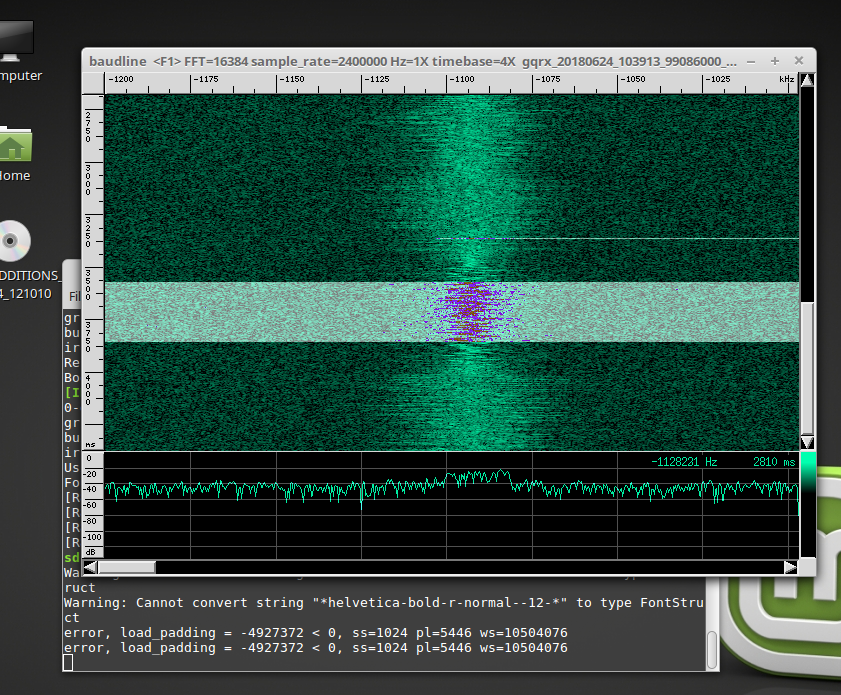
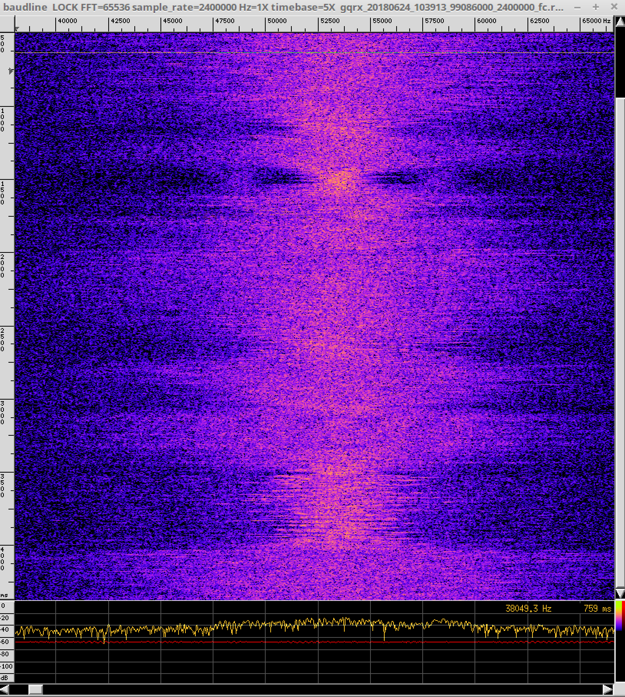

Baudline
========

Use case
--------

To analyze recorded raw IQ data I often use Baudline

To install, go to your wrk directory and download the tar.gz container containing the binaries:

.. code:: bash

    cd ~/wrk
    wget http://www.baudline.com/baudline_1.08_linux_x86_64.tar.gz

Unpack:

``tar xvfz baudline_1.08_linux_x86_64.tar.gz``

Run
---

``./baudline_1.08_linux_x86_64/baudline``

Basic use
----------

The usage is a bit special - but worth the effort. Would be another document! The baudline website has a lot good informations: `http://www.baudline.com/ <http://www.baudline.com/>`__
