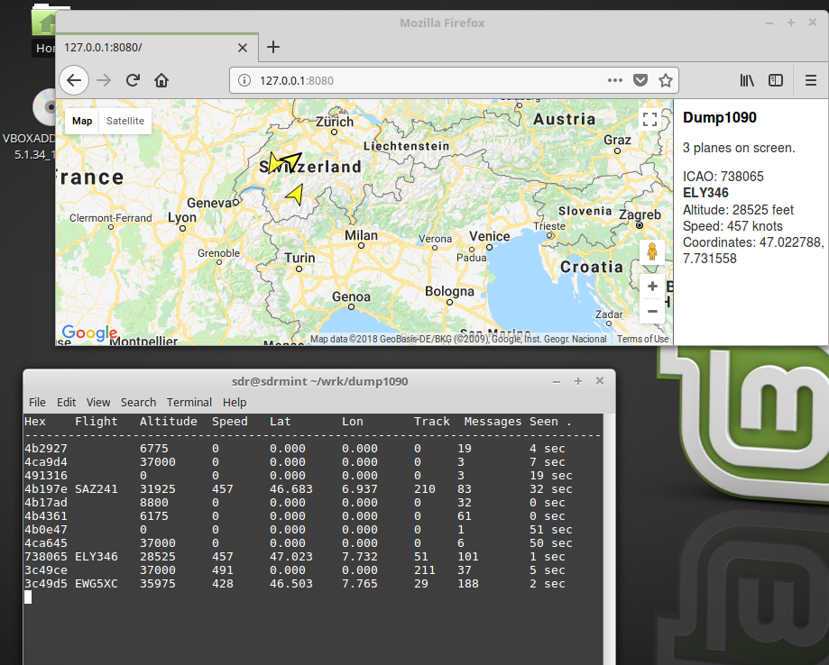

Build from source
=================

.. code:: bash

   cd ~/wrk
   git clone https://github.com/antirez/dump1090.git
   cd dump1090
   make

Run with an RTL-SDR stick
--------------------------

To run go to the dump1090 directory we just cd-ED into, connect and bind the USB RTL-SDR stick in virtualbox and type:

``./dump1090 --net --interactive``

Open Firefox and navigate to ``http://127.0.0.1:8080``

You’re now able to track the planes above your -> Works best outsides :-)

