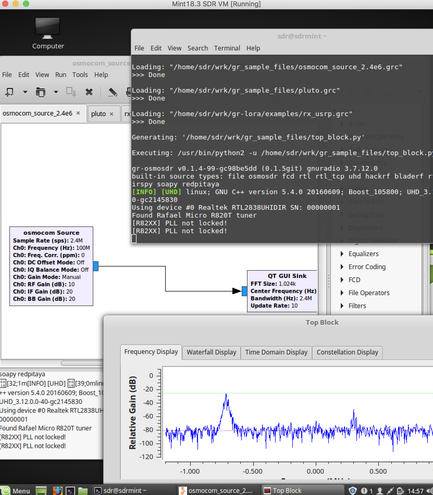
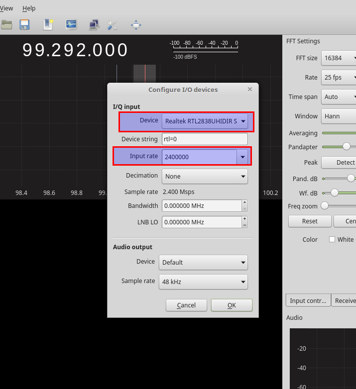
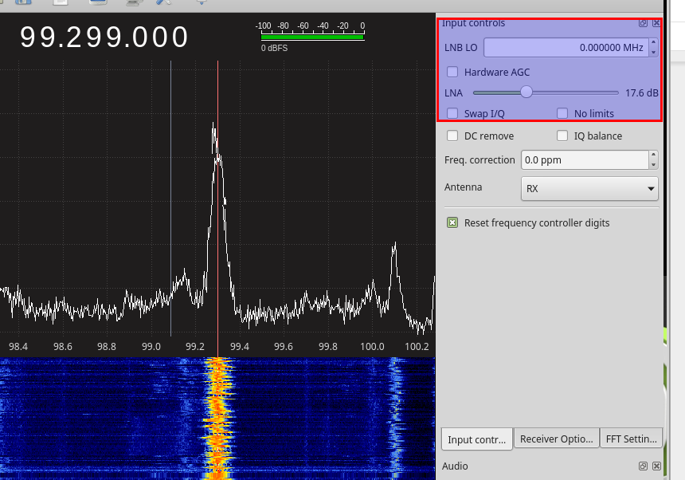
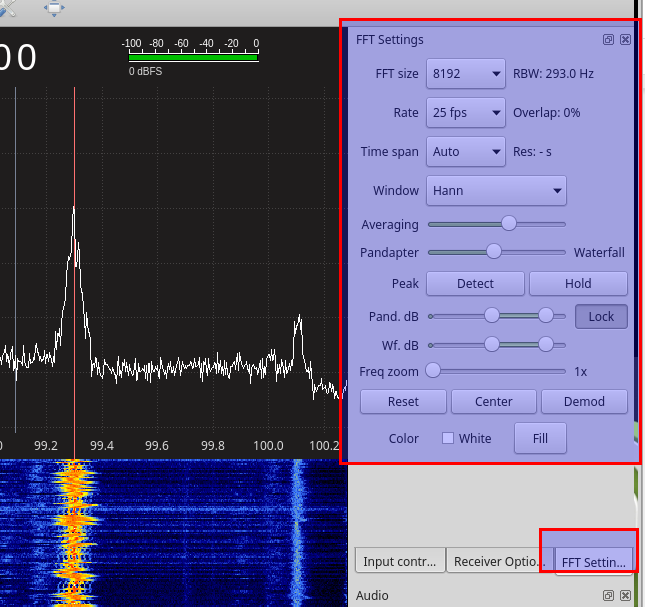
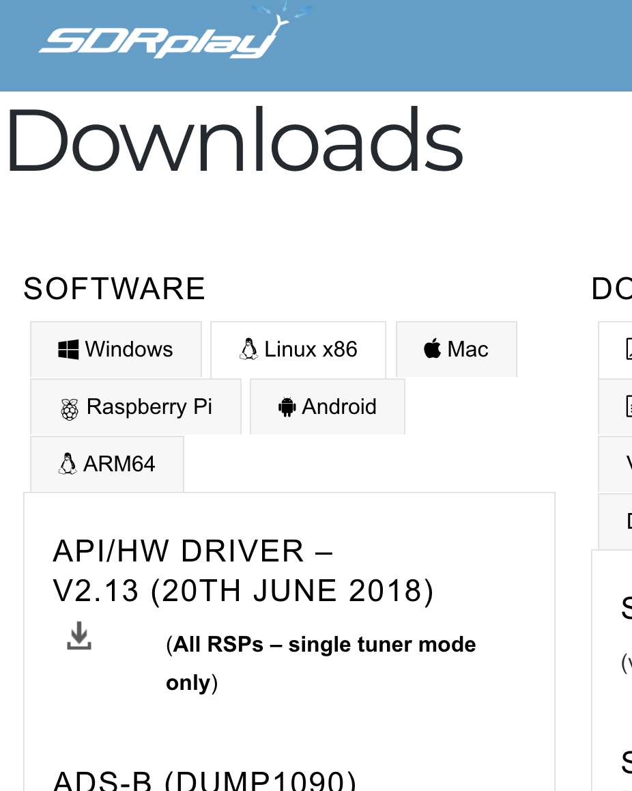

GNU Radio Setup
================

The Pybombs way
---------------

.. code:: bash

    sudo pip install setuptools
    sudo pip install git+git://github.com/gnuradio/pybombs.git

In your workdirectory ~/wrk generate a folder for pybombs to use as a prefix. This will install all sources and binaries into that prefix to make sure it’ll be separated from the system library and bin paths. Resulting in a clean environment:

.. code:: bash

    cd ~/wrk
    mkdir grc_wrk
    pybombs recipes add gr-recipes git+https://github.com/gnuradio/gr-recipes.git
    pybombs prefix init -a default ~/wrk/grc_wrk/default/ -R gnuradio-default

Now it’ll pull all required sources and build gnuradio companion. A few miles of output text will be generated on the screen and it’ll take a good amount of time. So time to mess up the lab or work through your email inbox.

After setup completed do:

.. code:: bash

    cd ~/wrk/grc_wrk/default
    source ./setup_env.sh

This enables the GNU Radio environment installed with pybombs…

Let’s add some more GR-* OOT Modules and GQRX

.. code:: bash

    pybombs install gr-osmosdr
    pybombs install gqrx
    pybombs install gr-iio
    sudo ldconfig
    volk_profile

Volk profile will create a profile to compute FFT optimized for the system it runs on. It’ll take quite a while, but will result in better graphics performance. The graphics performance in a VM is not good anyway. To use high-performance tools like gr-fosphor a native setup is required.

**Only run the following 3 lines, if you use an USRP:**

.. code:: bash

    sudo cp ~/wrk/grc_wrk/default/lib/uhd/utils/uhd-usrp.rules /etc/udev/rules.d/uhd-usrp.rules
    sudo udevadm control --reload-rules
    sudo udevadm trigger

Other OOT Modules I’d suggest to take a look at is:

-  gr-paint `https://github.com/drmpeg/gr-paint <https://github.com/drmpeg/gr-paint>`__
-  gr-gsm `https://github.com/ptrkrysik/gr-gsm <https://github.com/ptrkrysik/gr-gsm>`__  ....Ohhm, only use if you operate a cell network for development purposes!
-  gr-ieee802-11 `https://github.com/bastibl/gr-ieee802-11 <https://github.com/bastibl/gr-ieee802-11>`__ `https://github.com/bastibl/gr-ieee802-15-4 <https://github.com/bastibl/gr-ieee802-15-4>`__
-  re-DECTed >
   `https://github.com/znuh/re-DECTed <https://github.com/znuh/re-DECTed>`__
-  rtty/psk31 stuff: >
   `https://github.com/bitglue/gr-radioteletype <https://github.com/bitglue/gr-radioteletype>`__
-  Must-have: when not in a VM, using a native Linux PC with a good GPU: gr-fosphor   `https://github.com/osmocom/gr-fosphor <https://github.com/osmocom/gr-fosphor>`__ ( hint: when running on a recent PC hardware.... do a
   ``sudo apt install libfreetype6-dev ocl-icd-opencl-dev python-opengl``
   before installing.)

Most of them can be installed using the default pybombs recipes….

Add GRC environment to user profile
-----------------------------------

In a terminal window run:

.. code:: bash

    mkdir ~/bin
    echo 'source ~/wrk/grc_wrk/default/setup_env.sh' >> ~/.profile
    echo 'source ~/wrk/grc_wrk/default/setup_env.sh' >> ~/.bashrc
    echo 'export PATH=~/wrk/bin:$PATH' >> ~/.profile
    echo 'export PATH=~/wrk/bin:$PATH' >> ~/.bashrc

Reboot, or login/logout!

Installing OOT Modules from source
----------------------------------

Since we’ve installed GNU Radio in it’s own prefix directory custom OOT
modules e.g. GR-LORA must be built towards that directory.

``cd ~/wrk``

.. code:: bash

    git clone git://github.com/BastilleResearch/gr-lora.git
    cd gr-lora
    mkdir build && cd build
    cmake ../
    make && make install
    sudo ldconfig

The cmake switch ``-DCMAKE_INSTALL_PREFIX=~/wrk/grc_wrk/default`` will ensure to target the right prefix. Keep this in mind for your further installations of OOT modules.

Run GRC
-------

type command: ``gnuradio-companion``

GNU Radio Companion (ready for UHD, RTL-SDR, ADALM Pluto, RedPitaya, Airspy)

*Note: We’ve installed all GNU Radio stuff in the prefix path. Do not try to mix stuff with packages installed from the distribution’s Package manager… Do not simply install via ``sudo apt install gnuradio`` ...etc... ...since this will mix up things. Be careful when installing third party PPAs to not mess up your setup.*

Run GQRX
--------

You can now run the following tools *from a terminal*!

gqrx (UHD, RTL-SDR, RedPitaya, Airspy)

command: ``gqrx``

Use RTL-SDR with GQRX:
----------------------

Start GQRX by typing:

“gqrx” in a terminal

Select your stick and set an appropriate input sample rate.

Try to find a good gain value for the signal of interest by finding the best distance between the noise floor and the signal peek

Experiment a bit with the FFT settings to get the best out the visualization

Building experimental stuff outside the prefix directory
--------------------------------------------------------

When compiling libs from source, like special forks of GR-OSMOSDR etc… remember to adjust the target paths like shown with gr-lora above! If you don’t want to set your well working GNU Radio prefix directory at the risk of getting messed up, you can compile and install experimental stuff towards a total different target location.

Let’s say you got a brand new SDRPlay and need the non-standard gr-osmosdr source, from a 3rd party source repo to go for a test drive.

For SDRplay, first install the proprietary driver system wide. Download the API/HW Driver.

When Downloaded run:

.. code:: bash

    chmod +x ~/Downloads/SDRplay_RSP_API-Linux-2.13.1.run
    sudo ~/Downloads/SDRplay_RSP_API-Linux-2.13.1.run
    sudo ldconfig

Now build checkout the special sdrplay2 branch of the gr-osmosdr fork from sdrplay. We want gr-osmosdr build results installed within our home directory in a separate folder, /home/sdr/libs/gr-osmosdr-sdrplay

.. code:: bash

    cd ~/wrk
    git clone https://github.com/sdrplay/gr-osmosdr
    cd gr-osmosdr && git checkout sdrplay2 && mkdir build && cd build
    mkdir -p ~/wrk/libs/gr-osmosdr-sdrplay
    cmake -DCMAKE_INSTALL_PREFIX=~/wrk/libs/gr-osmosdr-sdrplay -DENABLE_NONFREE=yes -DENABLE_BLADERF=OFF ..
    make && make install

To make GNU Radio, GQRX etc make sure to pick up the shared libraries from your experimental directory, set the ``LD_LIBRARY_PATH`` & ``PYTHONPATH`` to the target directory.

.. code:: bash

    LD_LIBRARY_PATH=~/wrk/libs/gr-osmosdr-sdrplay/lib:$LD_LIBRARY_PATH
    PYTHONPATH=~/wrk/libs/gr-osmosdr-sdrplay/lib/python-2.7/dist-packages:$PYTHONPATH

Within that shell you can now start gnuradio-companion or gqrx and find the SDRplay as OSMOCOM-Source.

-> When sure, you want to target your prefix directory, the cmake switch would be ``-DCMAKE_INSTALL_PREFIX=~/wrk/grc_wrk/default``

If using an original RSP1, a few lines need to be added to ``/etc/modprobe.d/blacklist.conf`` by

``sudo nano /etc/modprobe.d/blacklist.conf``

Enter at the end of the file:

.. code:: bash

    blacklist sdr_msi3101
    blacklist msi001
    blacklist msi2500
