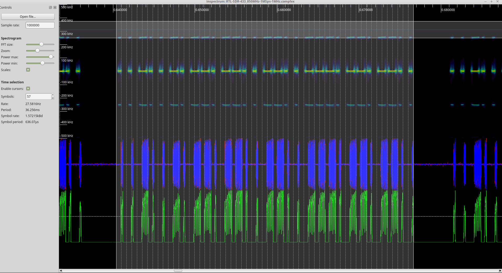

Inspectrum, GRC Burst Tags / Great M. Ossmann stuff (Not running in VM)
=======================================================================

Use case
--------

Ideas derived from the video of Michael Ossmann regarding “Whole Packet Clock Recovery” `https://www.youtube.com/watch?v=rQkBDMeODHc<https://www.youtube.com/watch?v=rQkBDMeODHc>`__

I’ve copied the GRC flow graph from the youtube video to GRC (No warranties that it is fully correct): `https://gist.github.com/krippendorf/149ffc7cca6ec33eb84daf2c70989829<https://gist.github.com/krippendorf/149ffc7cca6ec33eb84daf2c70989829>`__

Inspectrum is a tool for analysing captured signals, primarily from software-defined radio receivers.

libliquid-dev
-------------

.. code:: bash

   sudo apt-get update -y
   echo "deb http://cz.archive.ubuntu.com/ubuntu artful main universe" | sudo tee -a /etc/apt/sources.list.d/temp.list
   sudo apt-get update -y
   sudo apt-get install libliquid-dev -y
   sudo rm -f /etc/apt/sources.list.d/temp.list
   sudo apt-get update -y

....We only take ``libliquid-dev`` package from this repo. Make sure to not miss the ``sudo rm -f ....`` step

Clone and build
---------------

.. code:: bash

    sudo apt-get install qt5-default libfftw3-dev cmake pkg-config -y
    cd ~/wrk && git clone https://github.com/miek/inspectrum)
    cd inspectrum
    mkdir build && cd build && cmake .. && make
    sudo make install

Basic use
---------

The Python stuff mentioned in the video ist here:
`**https://github.com/mossmann/clock-recovery**<https://github.com/mossmann/clock-recovery>`__

Run with command: inspectrum