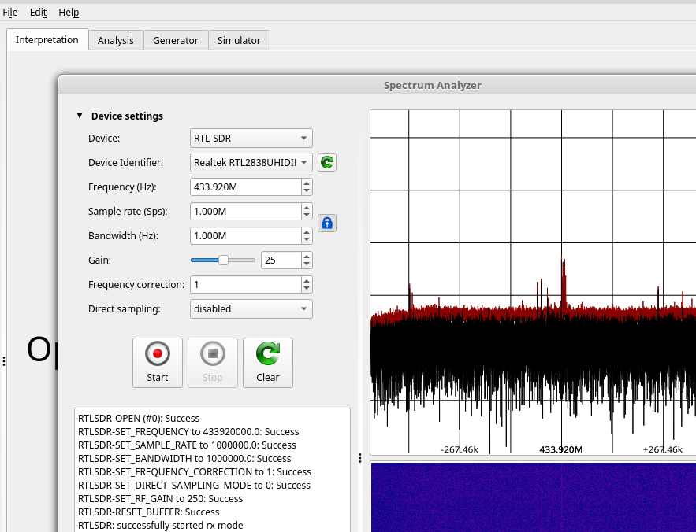

URH
====

Installation
-------------

More details on `https://github.com/jopohl/urh#linux <https://github.com/jopohl/urh#linux>`__

.. code:: bash

    sudo apt-get install python3-pip python3-dev
    sudo pip3 install --upgrade pip
    sudo pip3 install setuptools
    sudo pip3 install urh

*For a RaspberryPI:*

.. code:: bash

    sudo apt-get update
    sudo apt-get install python3-numpy python3-psutil python3-zmq python3-pyqt5 g++ libpython3-dev python3-pip
    sudo pip3 install urh

Basic use
---------

To run just type ``urh`` in a terminal

